# 🍔 Online Food App

A full-stack MERN (MongoDB, Express.js, React.js, Node.js) food ordering application with separate Admin and Customer modules.

## Features

### Customer Module
- Browse restaurants by city
- View restaurant menus with category filtering
- Add items to cart with quantity management
- Place orders with Cash on Delivery
- Track order status (Placed → Preparing → Ready → Delivered)
- View order history
- Submit ratings and feedback

### Admin Module
- Add/edit/delete restaurants with image upload
- Add/edit/delete dishes with categories and pricing
- Dashboard with charts (revenue, orders, status breakdown)
- Manage order statuses
- View customer feedback and ratings

### Authentication
- JWT-based authentication
- bcrypt password hashing
- Separate login/signup for Admin and Customer
- Protected routes for both roles

## Tech Stack

| Layer | Technology |
|-------|-----------|
| Frontend | React 18, React Router, Context API, Chart.js, Bootstrap 5 |
| Backend | Node.js, Express.js, JWT, bcrypt, Multer |
| Database | MongoDB with Mongoose |
| Extras | React Toastify, React Icons, Axios |

## Project Structure

```
├── backend/
│   ├── middleware/       # Auth & upload middleware
│   ├── models/           # Mongoose schemas (User, Restaurant, Dish, Order, Cart, Feedback)
│   ├── routes/           # Express API routes
│   ├── uploads/          # Uploaded images
│   ├── server.js         # Entry point
│   └── .env              # Environment variables
├── frontend/
│   ├── public/
│   └── src/
│       ├── components/   # Reusable components (Navbar, Spinner, OrderTracker, StarRating)
│       ├── context/      # AuthContext, CartContext (state management)
│       └── pages/        # All page components
│           ├── auth/     # Login/Register pages
│           ├── admin/    # Admin dashboard, restaurants, dishes, orders, feedback
│           └── customer/ # Home, menu, cart, orders, order detail
```

## Getting Started

# Food Delivery Web Application

A full-stack MERN (MongoDB, Express, React, Node.js) food ordering platform with Customer, Admin, and Delivery modules.

## Features

### Customer
- Browse restaurants and menus
- Add items to cart and place orders
- Track order progress
- View order history
- Submit ratings and feedback

### Admin
- Manage restaurants and dishes
- Manage orders and status updates
- View dashboard analytics
- Review customer feedback

### Delivery
- Delivery login and profile
- View assigned orders
- Update delivery progress

### Authentication and Security
- JWT-based authentication
- Password hashing with bcrypt
- Role-based protected routes

## Tech Stack

- Frontend: React 18, React Router, Context API, Bootstrap 5, Chart.js
- Backend: Node.js, Express.js, Mongoose, JWT, bcrypt, Multer
- Database: MongoDB

## Project Structure

```text
backend/
   middleware/
   models/
   routes/
   utils/
   server.js

frontend/
   public/
   src/
      components/
      context/
      pages/
```

## Getting Started

### Prerequisites
- Node.js 16+
- MongoDB running locally

### Backend

```bash
cd backend
npm install
npm run dev
```

Backend runs on http://localhost:5000

### Frontend

```bash
cd frontend
npm install
npm start
```

Frontend runs on http://localhost:3000

## Screenshots

### Admin

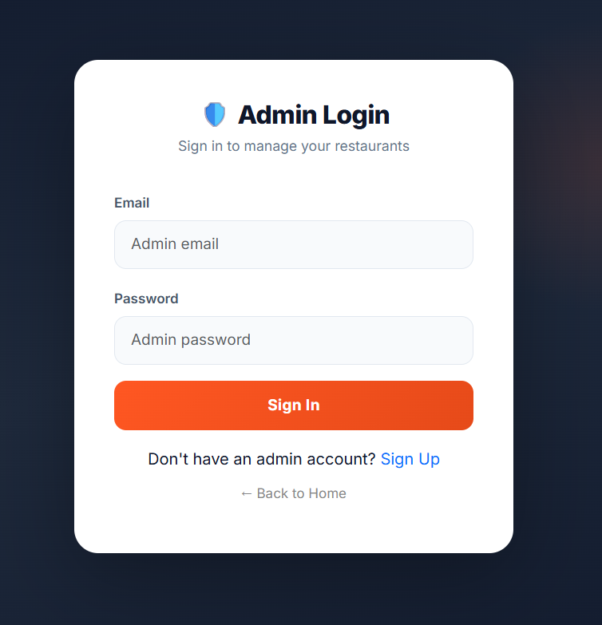
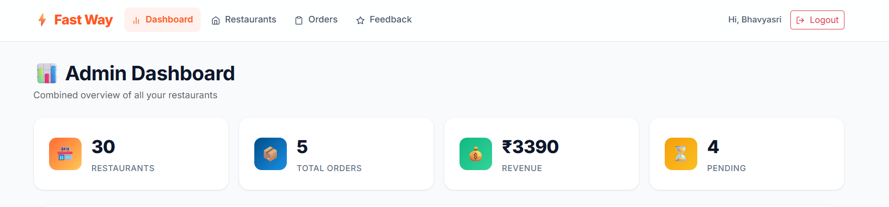
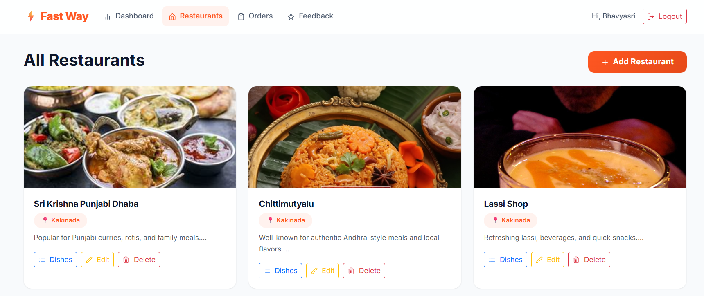
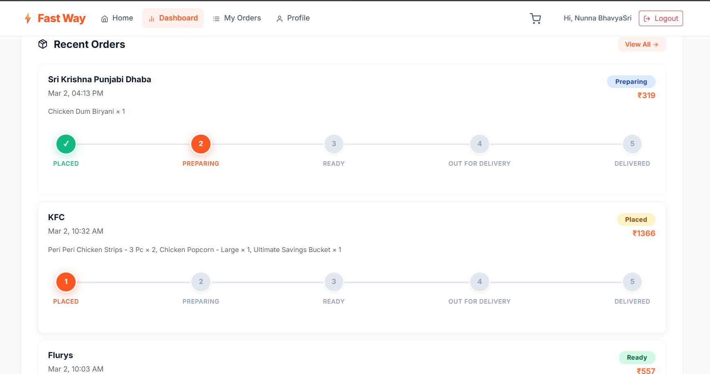
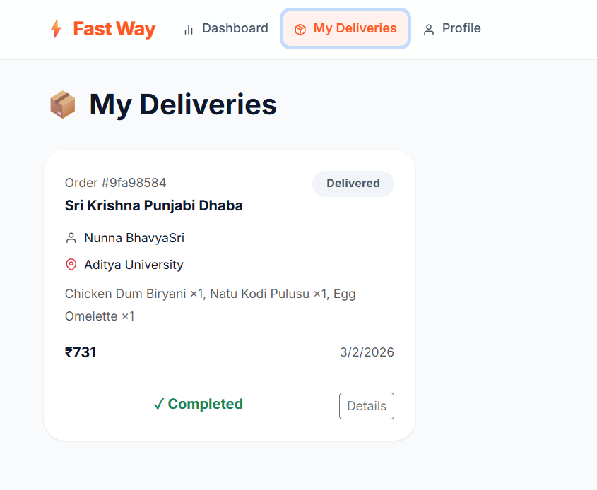
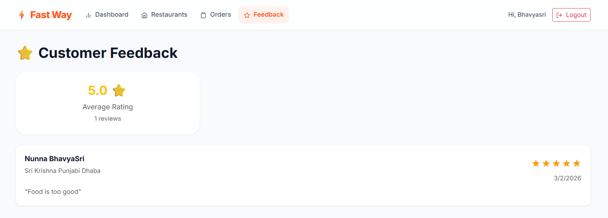
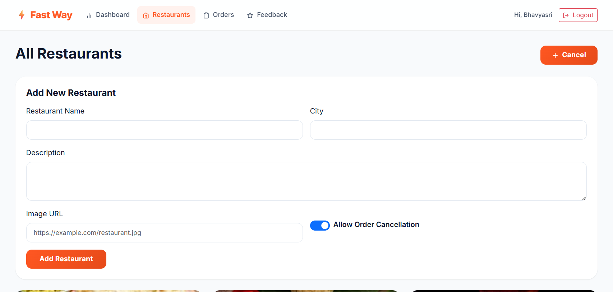

### Customer

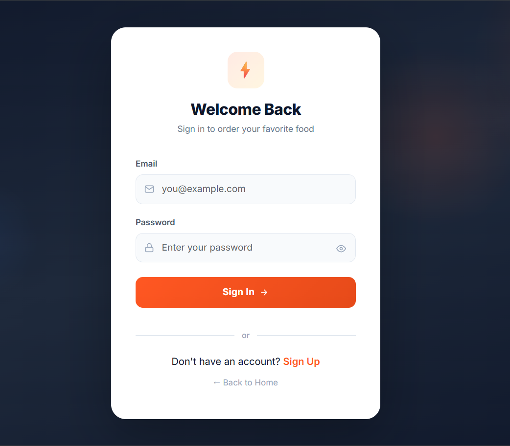
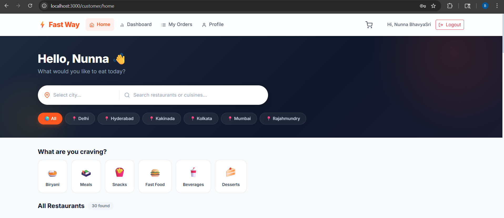
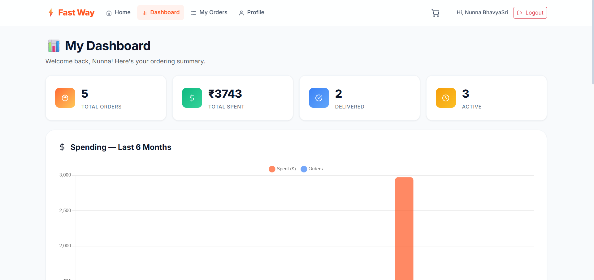
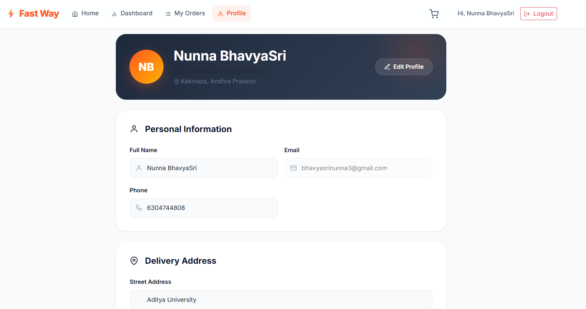
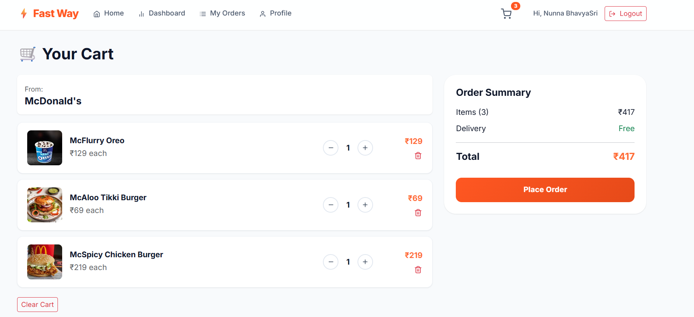
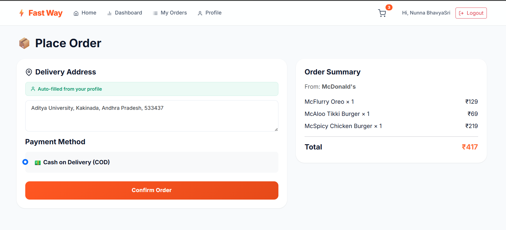
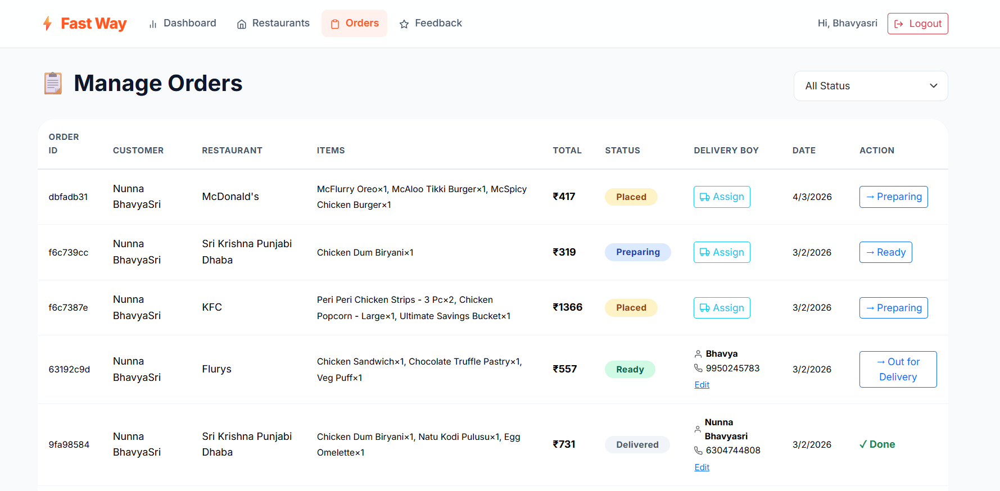

### Delivery

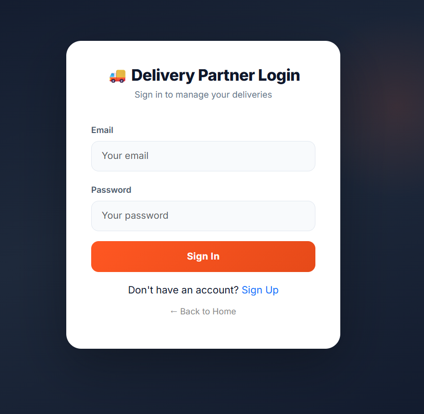
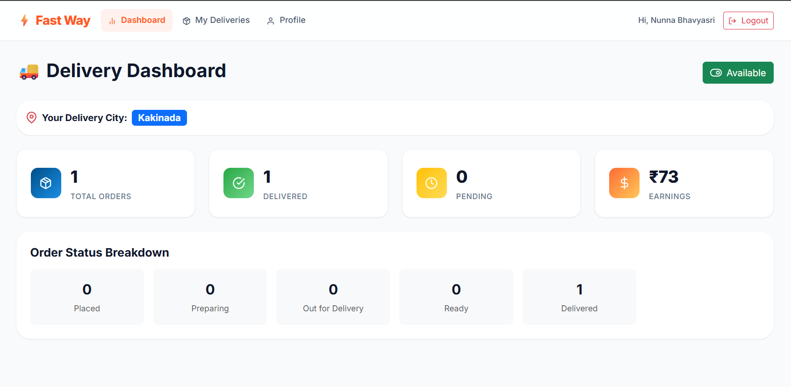
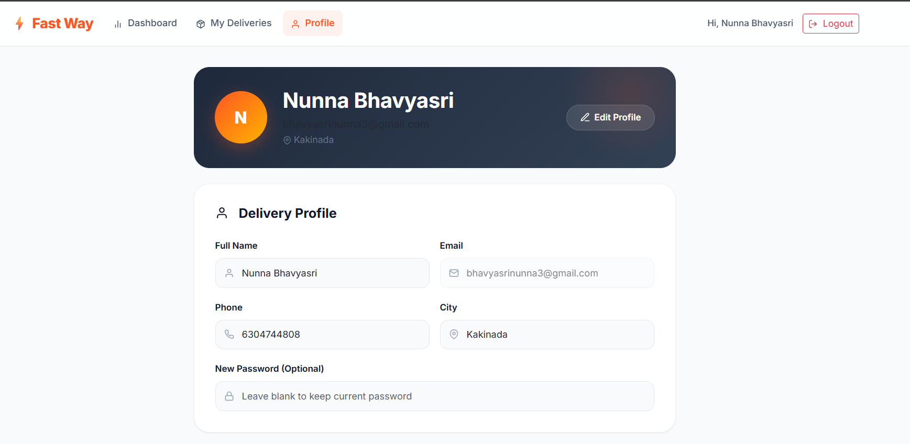

### Database

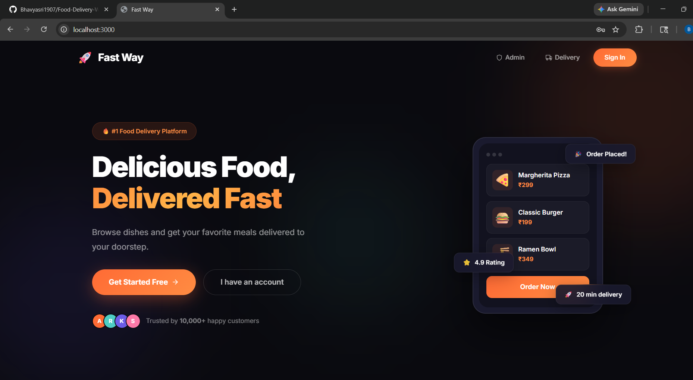
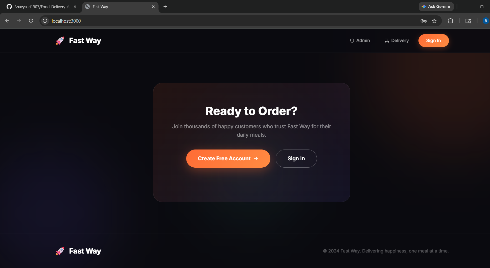
